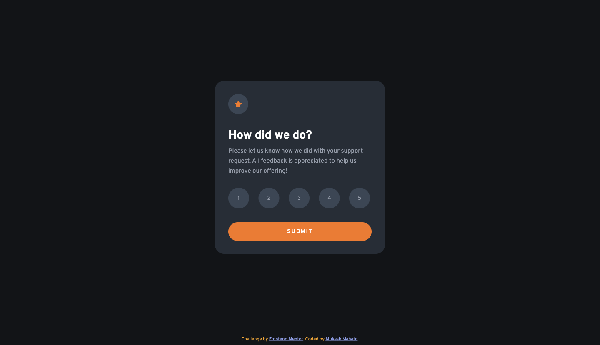
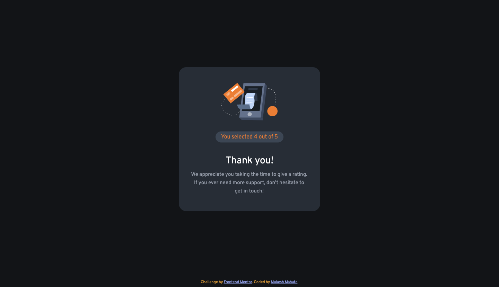
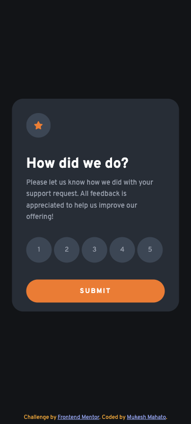
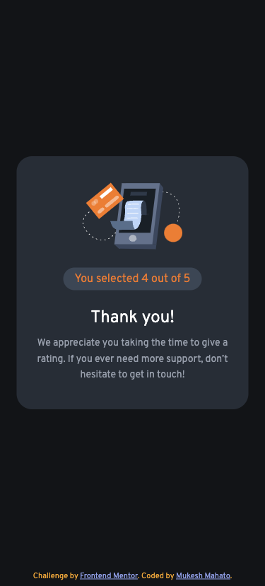

# Frontend Mentor - Interactive rating component solution

This is a solution to the [Interactive rating component challenge on Frontend Mentor](https://www.frontendmentor.io/challenges/interactive-rating-component-koxpeBUmI). Frontend Mentor challenges help you improve your coding skills by building realistic projects.

## Table of contents

-  [Overview](#overview)
   -  [The challenge](#the-challenge)
   -  [Screenshot](#screenshot)
      -  [Desktop Design](#desktop-design)
      -  [Desktop Thankyou State](#desktop-thankyou-state)
      -  [Mobile Design](#mobile-design)
      -  [Mobile Thankyou State](#mobile-thankyou-state)
   -  [Links](#links)
   -  [Built with](#⚙-built-with)
-  [Author](#author)

## Overview

### The challenge

Users should be able to:

-  View the optimal layout for the app depending on their device's screen size
-  See hover states for all interactive elements on the page
-  Select and submit a number rating
-  See the "Thank you" card state after submitting a rating

### Screenshot

#### Desktop Design

#### Desktop thankyou State

#### Mobile Design

#### Mobile thankyou State

### Links

-  Solution URL: [Go to solution](https://your-solution-url.com)
-  Live Site URL: [View Demo](https://iammukeshmahato.github.io/interactive-rating-component)

## ⚙ Built with

-  Semantic HTML5 markup
-  CSS custom properties
-  Flexbox
-  JavaScript

## Author

-  Website - [myselfmukesh.blogspot.com](https://myselfmukesh.blogspot.com/)
-  Frontend Mentor - [@iammukeshmahato](https://www.frontendmentor.io/profile/iammukeshmahato)
-  Facebook - [@iammukeshmahato](https://www.facebook.com/iammukeshmahato)
-  [Message me](https://m.me/iammukeshmahato)
